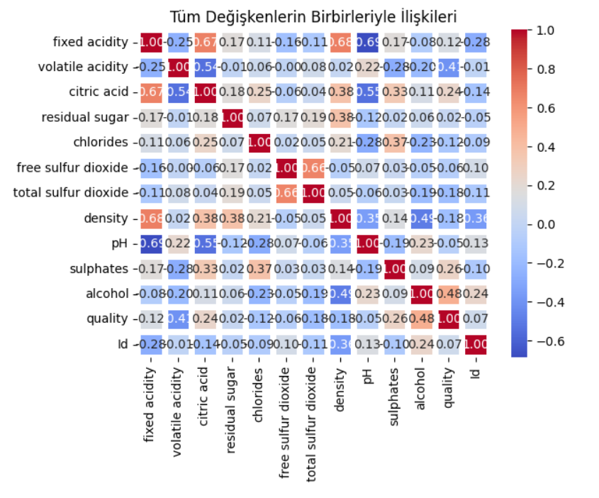
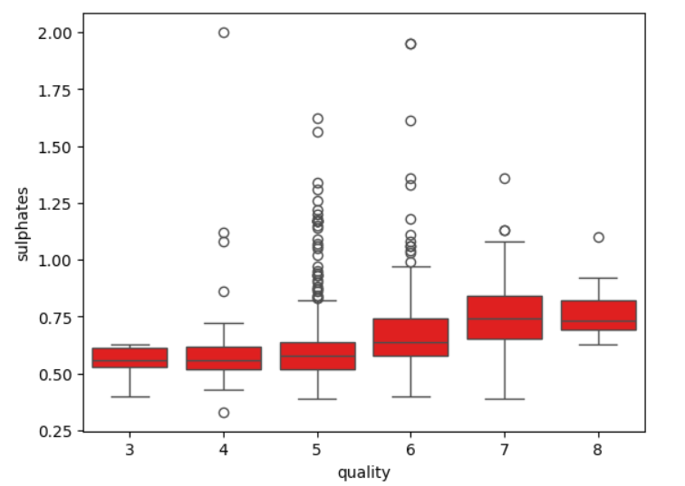
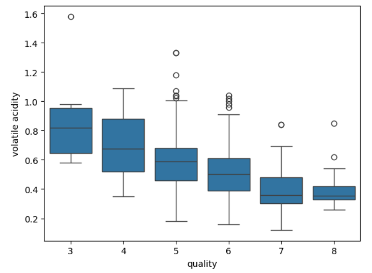
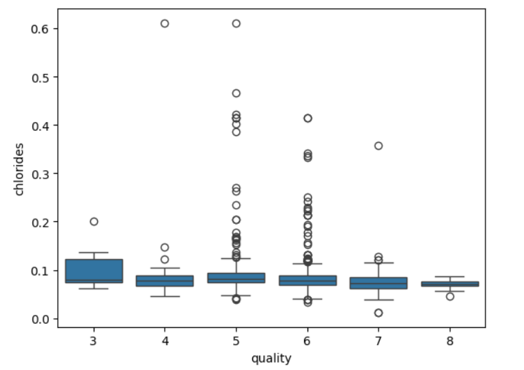
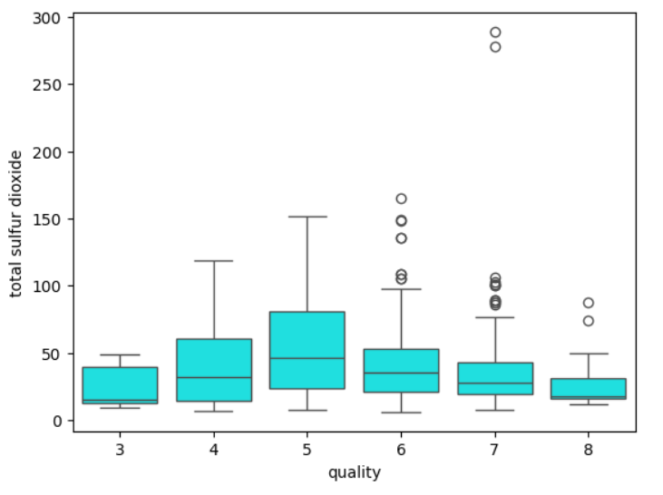
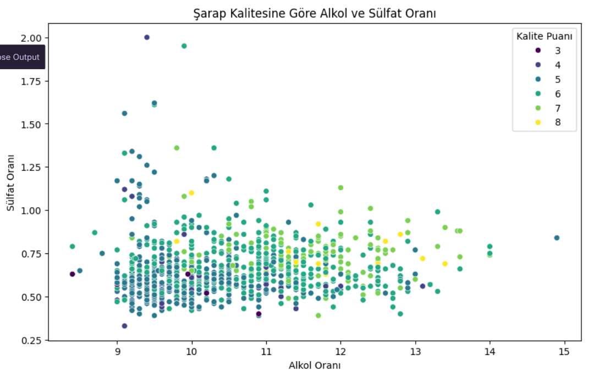

# 🍷 Red Wine Quality - Exploratory Data Analysis (EDA)

Bu projede, Python, Pandas ve Seaborn kütüphanelerini kullanarak kırmızı şarap kalitesini etkileyen kimyasal bileşenleri ve arkalarındaki gizli doğrusal/doğrusal olmayan ilişkileri inceledim. Amacım, ham verileri görselleştirme teknikleriyle işleyerek anlamlı içgörüler ve bir nevi "kaliteli şarap reçetesi" ortaya çıkarmaktır.

## 🛠️ Kullanılan Teknolojiler
* **Python 3**
* **Pandas** (Veri Manülasyonu ve Analizi)
* **Seaborn & Matplotlib** (Gelişmiş Veri Görselleştirme)

---

## 📊 Keşifçi Veri Analizi ve Bulgular

### 0. Büyük Resim: Korelasyon Matrisi (Pusulamız)
Analize başlamadan önce, tüm değişkenlerin birbiriyle olan ilişkisini makro düzeyde görebilmek için bir ısı haritası (Heatmap) çıkardım. Sonraki spesifik grafiklerimi bu matristen aldığım güçlü sinyallere göre şekillendirdim.

* **Analiz:** Matriste en dikkat çekici unsurlar; Kalite (`quality`) ile Alkol (`alcohol`) arasındaki güçlü pozitif yönlü bağ ($0.48$) ve Uçucu Asitlik (`volatile acidity`) ile olan güçlü negatif yönlü bağdır ($-0.40$). Ayrıca `fixed acidity` ile `citric acid` arasındaki $0.67$'lik doğal ortaklık, ileride kurulacak makine öğrenmesi modellerinde çoklu doğrusallık (*Multicollinearity*) riski taşıdığı için not edilmiştir.

---

### 1. Koruyucu Maddeler ve Kalite İlişkisi (Sülfat Miktarı)
Şarap üretiminde antioksidan ve koruyucu olarak kullanılan sülfat miktarının kalite üzerindeki etkisini incelemek için bir **Boxplot** grafiği kullandım.

* **Bulgu:** Şarabın kalite puanı arttıkça, içindeki sülfat miktarı da düzenli bir şekilde yükseliyor. Sülfat, şarabı zararlı bakterilerden koruduğu için ideal miktarda bulunması şarap kalitesini doğrudan yukarı taşıyor.

---

### 2. Kalite Düşmanları - Bölüm I: Uçucu Asitlik (Volatile Acidity)
Şarabın kalitesini baltalayan en güçlü negatif etken olan uçucu asitlik miktarını mercek altına aldım.

* **Bulgu:** Şarabın sirkeleşmesine yol açan uçucu asitlik miktarı arttıkça şarap kalitesi adeta aşağı çakılıyor. En kaliteli (7 ve 8 puanlık) şaraplarda bu oranın çok sıkı kontrol edilerek minimum seviyede tutulduğu görülmektedir.

---

### 3. Kalite Düşmanları - Bölüm II: Tuz Oranı (Chlorides)
Kaliteyi negatif etkileyen bir diğer unsur olan klorür (tuz oranı) seviyelerini inceledim.

* **Bulgu:** Tuz oranı ile kalite arasında net bir ters orantı var. Yüksek klorür içeren şarapların kalite puanları dipteyken, premium şaraplar son derece düşük, dengeli bir tuz oranına sahip.

---

### 4. Doğrusal Olmayan Trendler: Kükürt Dengesi (Total Sulfur Dioxide)
Veri analizinde her ilişki düz bir çizgide ilerlemez. Şaraptaki toplam kükürt dioksit gazının kalitedeki rolünü incelerken harika bir "ters U" (doğrusal olmayan) dalgalanma yakaladım.

* **Bulgu:** Kalite 3'ten 5 puana çıkana kadar kükürt miktarı artış gösteriyor (çünkü şarabı korumak için gaz şart). Ancak 7 ve 8 puanlık zirve şaraplara gelindiğinde kükürt miktarı aniden düşüyor. 
* **Analiz:** Kükürt gazının fazlası kimyasal koku yaptığı ve tadı bozduğu için kaliteyi düşürür. En kaliteli şaraplar, bu koruma sınırını tam **optimum (en dengeli)** noktada tutanlardır. Standart korelasyon fonksiyonlarının yakalayamadığı bu detayı veri görselleştirmenin gücüyle keşfetmiş olduk.

---

## 🏆 BÜYÜK FİNAL: Alkol, Sülfat ve Kalite Üçlüsü

Tüm analizlerin sonucunda kaliteyi en çok tetikleyen iki pozitif unsuru (Alkol & Sülfat) tek bir **Scatterplot** üzerinde birleştirdim ve noktaları kalite puanlarına göre renklendirdim (`hue="quality"`).

* **Sonuç:** Parlak renkli yüksek kaliteli (7 ve 8 puanlık) şarapların neredeyse tamamı grafiğin **sağ üst köşesinde** (yani hem yüksek alkol hem de yüksek sülfat bölgesinde) kümelenmiştir. Sol alt köşedeki (düşük alkol - düşük sülfat) şaraplar ise kalitesiz kalmaya mahkum olmuştur. Bu grafik, kaliteli bir şarabın formülünü tek bir karede özetlemektedir.

---
## 📂 Proje Yapısı
* `wine_quality_eda.ipynb`: Tüm analizlerin, veri temizleme adımlarının ve kod bloklarının bulunduğu Jupyter Notebook dosyası.
* `winequality-red.csv`: Analizde kullanılan ham veri seti.
* `README.md`: Projenin genel özeti ve veri hikayeciliği raporu.
